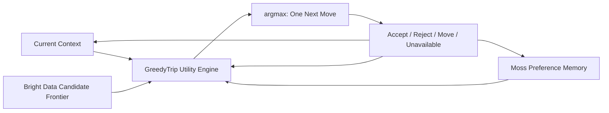

# GreedyTrip — Greedy Search × Trip

> **No itinerary. One best next move.**  
> Continuously re-optimized as the world and your preferences change.

GreedyTrip is an anti-itinerary voice agent that turns spontaneous travel into an online, one-step decision problem. It observes the current state, evaluates the feasible nearby frontier, commits to exactly one action, learns from the response, and computes again after every meaningful change.

```text
next = argmax utility(place | now, memory)
```

GreedyTrip never promises a full-day route and never claims a globally optimal day. It chooses the highest-value feasible next move under the state known right now.

## The decision loop



**Bright Data builds the frontier. Moss retrieves preference evidence. GreedyTrip applies the heuristic and chooses the next node.**

- **Bright Data** expands the current frontier with nearby public-place records and answers, “What actions are currently available?”
- **Moss** indexes evolving preferences locally during the conversation, retrieves the relevant memories before every decision, and answers, “What does this user value or avoid?”
- **GreedyTrip** combines those signals with structured constraints, calculates deterministic utility, and selects one next move.

Bright Data does not rank destinations. Moss does not select a destination. Gemini may interpret language, but it does not score candidates. The final choice always comes from inspectable deterministic code.

## Moss is an in-process semantic runtime

The hackathon uses one fixed server-side index name for every user and reset:

```text
MOSS_INDEX_NAME=greedytrip-demo-memory
```

The `MossClient` and `SessionIndex` are held in a module/global singleton for the long-running local Node process. A Reset Demo action creates a new hashed `userScope` or `tripId`; it never creates a new cloud index. Direct identifiers such as email addresses are not stored in the index name or metadata.

Each memory document uses string-only metadata, including hashed `userScope`, `tripId`, `topic`, `polarity`, `strength`, `kind`, and `updatedAt`. Queries include a `userScope` metadata filter so memories from other users cannot contribute.

Preferences are canonical documents rather than an unlimited utterance log. Stable IDs such as `pref:{userScope}:ambience`, `pref:{userScope}:interest:art`, and `pref:{userScope}:touristy` are written with `addDocs(..., { upsert: true })`. Updating a preference replaces its topic document; removing a preference deletes it. Raw utterances stay in the transcript. An unexplained rejection or reported closure is not converted into durable taste memory.

The feedback path is local-first and latency-safe:

1. Interpret the utterance and upsert the canonical memory.
2. Await local `session.addDocs()`.
3. Immediately query Moss again and rerun deterministic utility.
4. Return and speak the new recommendation when intervention is justified.
5. Schedule a debounced, serialized `pushIndex()` checkpoint in the background.

Reranking never waits for cloud persistence, and cloud pushes never overlap. A submitted push stays **submitted** until its job status verifies completion.

The UI reports these independently:

- **Moss Local Index:** ready / updated / failed
- **Moss Retrieval:** live / fallback
- **Moss Cloud Sync:** idle / submitted / completed / failed

Judge view uses real measurements rather than demo constants: fixed index name, local document count, `addDocs` duration, candidate query count, retrieval latency, retrieved text/similarity/polarity/strength, Memory Fit delta, and cloud-checkpoint status.

For each feasible candidate, Moss retrieval uses approximately `topK: 6`, `alpha: 0.9`, the current `userScope` filter, and a configurable minimum similarity. Results below the threshold are ignored; only the strongest bounded evidence per topic contributes. Topic contributions are capped and the combined memory score is normalized to approximately -1…1, so duplicates cannot inflate utility. Similarity is evidence, not a probability or final rank.

Moss runs only in server-side Node routes. The primary demo target is one long-running `npm run dev` or `npm run start` process; an in-memory `SessionIndex` is not inherently coordinated across multiple serverless instances. Session initialization failure activates the honest local evidence fallback.

## Why greedy instead of a full itinerary?

- User preferences are incomplete at the start and become clearer through use.
- Availability can change after a plan is made.
- Every movement changes distance and feasibility.
- Remaining travel time decreases.
- Changing one next move is cheap; following a stale full-day plan is costly.
- Repeated one-step decisions stay adaptive while a fixed itinerary becomes stale.

## What greedy does not mean

“Greedy” does not mean selfish or consumption-maximizing, and it does not guarantee a globally optimal day. It means selecting the highest-value feasible next action under the current known state, committing only to that action, then recomputing from the next state.

The normal interface therefore shows one active recommendation and zero planned-ahead stops. Ranked alternatives are visible only in Judge view.

## Deterministic utility and intelligent silence

Every feasible candidate receives a clamped 0–100 utility breakdown:

- Positive: Memory Fit, Accessibility, Right-Now Opportunity, Serendipity, Local Character, and Quality.
- Negative: Travel Friction, Cost Friction, Crowd Risk, Repetition Penalty, and Switching Friction.

Missing facts remain neutral. Crowd risk is an explicitly labeled heuristic based on available public signals, never a live crowd or wait-time claim.

After a context change, GreedyTrip always reranks but does not always speak. It compares the best challenger with the current move:

```text
raw gain = challenger utility - current utility
net gain = raw gain - switching friction
interrupt when net gain >= 8
```

Switching friction is exported configuration, not a hidden magic number:

- **5 points** after the user accepts and starts following the current move.
- **1 point** before acceptance.
- **0 points** after rejection, on a manual alternative request, or when the current place is unavailable.

If a challenger does not clear the 8-point intervention threshold, GreedyTrip keeps the current move, skips text-to-speech, and records an inspectable Decision Snapshot. Silence is an explicit product decision, not a missing response.

## Explainable decisions

Every active recommendation is built from candidate facts, real utility components, and retrieved memory evidence. It explains:

- **WHY THIS** — the strongest preference or experience reason.
- **WHY NOW** — the strongest current-context reason.
- **WHAT CHANGED** — why the decision differs from the previous one, or why it is the initial winner.

Before and after preference feedback, Decision Snapshots capture ranks, scores, score deltas, and primary causes. The Decision Shift view makes the sequence visible: the user teaches the agent, Moss stores or retrieves that evidence, and deterministic ranking changes.

## Signature demo

The credential-free fixtures are arranged to demonstrate the algorithm rather than hardcoded dialogue:

1. The interview asks for quiet places, a ten-minute walk, art and hidden gems, and uniqueness.
2. A single credible nearby destination becomes the first greedy winner. The deterministic fixture uses a relatively popular art destination; a live Bright Data cache may select a different real place.
3. “That feels too touristy” adds a strong negative tourist-oriented memory and reranks the entire feasible frontier.
4. A quieter independent art space becomes the new winner and the real before/after Decision Shift appears.
5. The first simulated movement changes scores but stays below the intervention threshold, producing intelligent silence.
6. Marking the current place unavailable bypasses switching friction and forces a meaningful spoken replacement.
7. “Show me the map and photos” opens visual detail only when requested.

Presentation Mode exposes reliable controls for each stage. Every control-generated action is labeled **Simulated demo event**; voice and ordinary text interaction continue to use the same live application paths.

## Architecture and stack

- Next.js 16 App Router, React 19, strict TypeScript, Tailwind CSS 4
- `@moss-dev/moss` local-first semantic memory
- Bright Data Google Maps full-info dataset via asynchronous discovery
- Gemini API structured interpretation with Zod validation
- Browser-native Web Speech, Geolocation, Wake Lock, and Google Maps Embed APIs
- lucide-react, Vitest, and tsx
- No database, authentication, general-purpose agent framework, booking system, route optimizer, or maintained scraping code

See [docs/architecture.md](docs/architecture.md) for the request flow, utility model, snapshots, refresh policy, and failure boundaries.

## Setup

Requirements for a fresh clone: Node.js 20.9 or newer.

On the provided Windows hackathon machine, the dependencies and bundled Node runtime are already available:

```cmd
start-demo.cmd prepare
start-demo.cmd
```

`start-demo.cmd` creates `.env.local` from the example when needed. Run `warm-brightdata.cmd` separately before judging only when you want to refresh the real Bright Data cache; the fixture fallback remains usable if that collection is slow.

For a fresh clone on another machine:

```bash
cp .env.example .env.local
npm install
npm run demo:prepare
npm run dev
```

Open [http://localhost:3000](http://localhost:3000), tap **Start trip**, and allow microphone access if desired. Every interaction also has text, button, and Presentation Mode fallbacks.

Startup skips a new live scrape so the UI is immediate; any existing cache remains explicitly labeled `Cached`.

### Recommended judge configuration

For the lowest-latency judging path, configure Moss and Bright Data and warm the Bright Data cache once. The deterministic local interpreter handles the prepared interview, rejection, movement, unavailable-place, map, and reset commands without a network round trip, even when Gemini is configured. Gemini is used only for unrecognized free-form language; it never ranks or scores a place.

For a more conversational demo, set a free-tier `GEMINI_API_KEY`. GreedyTrip remains local-first: known interview answers and operational commands never call Gemini, while only an unrecognized utterance uses one bounded structured-output request to `gemini-3.1-flash-lite`. `GEMINI_INTERPRETER_TIMEOUT_MS` defaults to 2500 ms, the application never retries, and any quota, timeout, malformed response, or API failure immediately returns the local fallback result. The header distinguishes `Gemini · Hybrid` from an actual `Gemini · Live` turn.

```cmd
start-demo.cmd prepare
warm-brightdata.cmd
start-demo.cmd
```

The readiness screen should report **Moss configured**, **Bright Data configured**, and either **Gemini configured → hybrid fallback ready** or **Gemini missing → local interpreter ready**. Never commit `.env.local`, paste credentials into issue text, or include `.cache`, `.next`, `node_modules`, or judge logs in a public upload; the repository ignore rules exclude all of them.

## Environment variables

| Variable | Purpose | Required? |
|---|---|---|
| `MOSS_PROJECT_ID`, `MOSS_PROJECT_KEY` | Moss local semantic runtime and optional cloud checkpoint | No; token-overlap memory fallback |
| `MOSS_INDEX_NAME` | Fixed shared index name; defaults to `greedytrip-demo-memory` | No |
| `MIN_MEMORY_SIMILARITY` | Minimum Moss evidence similarity; defaults to `0.12` | No |
| `MOSS_SYNC_POLL_MS`, `MOSS_SYNC_MAX_POLLS` | Cloud checkpoint completion polling controls | No |
| `BRIGHTDATA_API_KEY` | Live nearby Google Maps discovery | No; cache or synthetic fixture |
| `BRIGHTDATA_GOOGLE_MAPS_DATASET_ID` | Bright Data dataset override | No |
| `GEMINI_API_KEY` | Free-form structured interpretation | No; local deterministic interpreter |
| `GEMINI_MODEL` | Gemini model override; defaults to `gemini-3.1-flash-lite` | No |
| `GEMINI_INTERPRETER_TIMEOUT_MS` | Unknown-utterance latency ceiling; defaults to 2500 ms | No |
| `NEXT_PUBLIC_GOOGLE_MAPS_EMBED_API_KEY` | Browser-safe map iframe key | No; coordinates and deep link |
| `NEXT_PUBLIC_AGENT_LANGUAGE` | Recognition and synthesis locale | No; `en-US` |
| `GREEDYTRIP_DEMO_MODE` | Enables demo-oriented defaults | No |
| `GREEDYTRIP_PERSIST_MEMORY` | Allows background Moss `pushIndex()` | No |
| `GREEDYTRIP_BRIGHTDATA_CACHE_TTL_MINUTES` | Candidate cache lifetime | No; 24 hours for judge readiness |
| `GREEDYTRIP_BRIGHTDATA_WARMUP_TIMEOUT_MS` | Maximum pre-demo live collection wait | No; 15 minutes |

Only the Google Maps embed key is browser-visible. Moss, Bright Data, and Gemini credentials stay in server-only routes and are never logged. Free-tier Gemini inputs may be used by Google to improve its products, so GreedyTrip sends only the short utterance plus the interview step—not identity, location, candidates, or Moss evidence.

## Commands

```bash
npm run dev            # local development server
npm run build          # production build
npm run lint           # ESLint
npm run typecheck      # strict TypeScript validation
npm run test           # Vitest suite
npm run seed:places    # cache live Powell Street records when configured
npm run demo:prepare   # credential-safe readiness check and optional seed
npm run check          # lint + typecheck + tests + production build
```

## Honest fallback modes

| Integration | Live path | Fallback path |
|---|---|---|
| Bright Data | Async Google Maps discovery | Valid neighborhood cache, then 10 clearly labeled synthetic records |
| Moss | In-process `SessionIndex` retrieval + optional serialized cloud checkpoint | In-memory token-overlap evidence using the same bounded evidence shape |
| Gemini | Free-tier structured interpretation for unknown utterances | Deterministic command/interview keyword interpreter |
| Voice | Web Speech recognition and synthesis | Text field and visible action/answer buttons |
| Map | Google Maps Embed iframe | Coordinate preview and Google Maps deep link |
| Location | Browser geolocation | Powell Street / Yerba Buena / Union Square simulator |

Integration badges and Judge view always say **Live**, **Cached**, **Fixture**, or **Fallback**. A fallback is never presented as sponsor traffic.

## Data provenance and limitations

Live ratings, reviews, coordinates, hours, prices, URLs, and photos come only from normalized Bright Data records. Missing values remain unknown. Fixture records are synthetic and visibly labeled. Rarity and potential crowd risk use review volume and derived tags as explicit heuristics; they are not live crowd, wait-time, or safety claims.

- Browser speech is page-active; it does not provide true locked-screen or suspended-browser background audio.
- Wake Lock is best effort and browser-dependent.
- There is no booking, routing, authentication, cross-device state, or multi-stop itinerary.
- Server in-memory fallback memories reset with the process; Moss persistence is the production path.
- Bright Data discovery can take time, so candidate collection begins concurrently with the interview and cache/fixture paths keep the demo responsive.

See [docs/demo-script.md](docs/demo-script.md) for the exact three-minute presentation.
