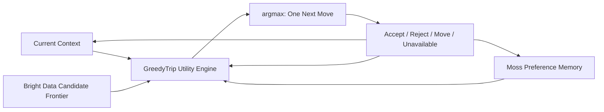

# GreedyTrip architecture

## Product invariant

GreedyTrip is **Greedy Search × Trip**: an online one-step decision engine for spontaneous travel.

```text
C_t = all currently feasible nearby places
a_t = argmax over c in C_t of Utility(c | S_t)
```

`S_t` contains the current location and time, optional remaining travel time, structured profile and hard constraints, relevant Moss memories, visited/rejected/unavailable places, recent categories, and the current recommendation and movement state.

GreedyTrip commits to exactly one action. Acceptance starts a current navigation commitment, not a future route. Accept, reject, movement, feedback, or unavailability changes `S_t`; the engine then recomputes from the new state. It does not generate a day plan, run route optimization or A*, or claim global optimality.

## System model



**Bright Data builds the frontier. Moss retrieves preference evidence. GreedyTrip applies the heuristic and chooses the next node.**

The boundaries are deliberate:

- Bright Data supplies and refreshes nearby public-place records. It expands the action frontier but never ranks it.
- Moss indexes soft, evolving preference memory locally inside the Node process and retrieves per-candidate evidence before every decision. It never selects a destination.
- Hard constraints remain structured application state: walking limit, location, excluded IDs, unavailable IDs, visited IDs, and current commitment.
- Gemini may map free-form language to structured intent, profile patches, or memory drafts. It never produces numeric utility and never chooses the winner.
- Pure GreedyTrip functions filter the frontier, calculate every utility component, apply commitment rules, and select the final action.

## Request and decision flow

1. **Observe.** `Start trip` creates or loads a browser user ID, requests Wake Lock, starts the interview, and triggers candidate collection without waiting for it.
2. **Interpret.** `/api/agent/turn` first handles known commands and interview answers locally with no network call. Only an unrecognized or ambiguous utterance uses one bounded Gemini structured-output request. The response is parsed and Zod-validated; quota, timeout, HTTP, JSON, or schema failure immediately falls back to the local result.
3. **Remember locally.** The server creates or updates a canonical memory document, awaits local `session.addDocs(..., { upsert: true })`, and records the real update duration.
4. **Build the frontier.** Bright Data discovery, a valid neighborhood cache, or clearly labeled synthetic fixtures supply candidate records.
5. **Filter.** Known-closed, rejected, unavailable, visited, and beyond-limit candidates are removed before scoring.
6. **Retrieve evidence.** A factual, heuristically labeled description of each feasible candidate queries the local Moss session with the current hashed `userScope` filter. Fallback mode returns the same bounded evidence shape using local token overlap.
7. **Rank.** `calculateCandidateUtility` computes every component. `selectGreedyNextMove` sorts deterministically by final utility, with candidate ID as a stable tie-breaker.
8. **Commit or stay silent.** The engine compares the frontier maximum with the current move, applies switching friction, and decides whether intervention is justified.
9. **Explain and snapshot.** Deterministic templates produce WHY THIS, WHY NOW, and WHAT CHANGED. Every decision creates an inspectable snapshot.
10. **Learn and recompute.** Acceptance, rejection, movement, a manual request, or unavailability updates state and repeats the loop. A debounced cloud checkpoint may run later; immediate ranking never waits for it.

The normal UI renders only the selected recommendation. The ranked frontier appears only in Judge/Presentation views.

## Moss local runtime and identity model

Moss is an in-process semantic memory runtime, not merely a remote preference database. `addDocs` and `query` happen locally inside the long-running Node demo process. `pushIndex` is an optional cloud persistence checkpoint.

The application opens exactly one server-side session using a fixed index:

```ts
const session = await client.session(
  process.env.MOSS_INDEX_NAME ?? "greedytrip-demo-memory",
);
```

The `MossClient` and `SessionIndex` live in a module/global singleton. Reset Demo rotates a hashed `userScope` or `tripId`, never the index name. Direct identifiers are not used in the index name or metadata.

All `DocumentInfo.metadata` values are strings:

```ts
{
  userScope: "7c31a1",
  tripId: "trip-001",
  topic: "touristy",
  polarity: "-1",
  strength: "3",
  kind: "rejection",
  updatedAt: "2026-07-18T18:20:00.000Z",
}
```

Every query is scoped to the current user:

```ts
filter: {
  field: "userScope",
  condition: { $eq: userScope },
}
```

## Canonical memory documents

Preference memory uses stable IDs and upsert semantics rather than appending duplicate utterances:

```text
pref:{userScope}:ambience
pref:{userScope}:max-walk
pref:{userScope}:interest:art
pref:{userScope}:interest:hidden
pref:{userScope}:touristy
pref:{userScope}:crowding
pref:{userScope}:budget
```

`session.addDocs(docs, { upsert: true })` updates the existing topic. A preference that no longer applies is deleted. Raw utterances remain in the transcript. A rejection without a reason and a reported closure are operational events, not durable preferences.

## Local update, immediate rerank, background checkpoint

Explicit feedback follows this ordering:

1. interpret the utterance;
2. create or update its canonical memory document;
3. await the local `addDocs` call;
4. immediately query the updated local session;
5. recalculate deterministic utilities and decide whether to speak;
6. schedule a debounced `pushIndex` checkpoint in the background.

Cloud pushes use a serialized queue and cannot overlap. Recommended checkpoints occur after the complete interview, after a strong explicit rejection, and when a trip ends. A `pushIndex` result is **submitted**, not **completed**; the latter status is shown only after `getJobStatus(jobId)` verifies completion.

The product exposes three independent statuses:

| Surface | Values |
|---|---|
| Moss Local Index | ready / updated / failed |
| Moss Retrieval | live / fallback |
| Moss Cloud Sync | idle / submitted / completed / failed |

Judge view reports real values only: index `greedytrip-demo-memory`, `session.docCount`, measured local update duration, candidate query count, measured retrieval latency, retrieved text and similarity, polarity, strength, Memory Fit delta, and cloud status. Local indexing is never mislabeled as completed cloud persistence.

## Bounded Moss retrieval evidence

For each feasible candidate, the server builds a concise description using facts and explicitly labeled heuristics. A popular destination can be described semantically as a major downtown landmark with high review volume and limited independent-local signals; repeating the literal word “touristy” is not required for the memory to retrieve.

Moss query defaults are approximately `topK: 6` and `alpha: 0.9`, plus the current `userScope` metadata filter. A configurable `MIN_MEMORY_SIMILARITY` removes weak results. The evidence reducer then:

1. parses string metadata for topic, polarity, and strength;
2. keeps only the highest-impact result per topic;
3. caps each topic contribution;
4. normalizes the combined memory score to approximately -1…1.

Similarity is not treated as probability. Duplicate same-topic documents cannot multiply a score, and the count of stored memories cannot inflate utility. Moss retrieves relevant memories; GreedyTrip deterministically decides how much they affect utility and still selects `argmax deterministicUtility(candidate)`.

## Feasible frontier

`feasibleCandidateFrontier` excludes a candidate when any of the following is true:

- its source explicitly reports it closed;
- its ID is rejected/excluded, unavailable, or already visited;
- its estimated walking time exceeds the hard maximum.

Walking time uses Haversine distance at the exported assumption of 80 meters per minute. Unknown opening hours are neutral and do not cause exclusion.

## Deterministic utility

Each `CandidateUtility` exposes a clamped 0–100 total plus all inputs and explanation factors.

| Component | Direction | Implemented range | Evidence |
|---|---|---:|---|
| Memory Fit | Positive | 0–30 | Signed Moss/local memory evidence |
| Accessibility | Positive | 0–15 | Distance and hard walking preference |
| Right-Now Opportunity | Positive | 0–12 | Known open state, relevant meal window, reliable closing time |
| Serendipity | Positive | 0–12 | Interest match plus credible hidden/independent/less-reviewed signals |
| Local Character | Positive | 0–8 | Available local and independent tags |
| Quality | Positive | 0–8 | Source rating; unknown is neutral |
| Travel Friction | Negative | 0–10 | Distance beyond preference; hard limit still filters first |
| Cost Friction | Negative | 0–5 | Known price-level conflict; unknown is neutral |
| Crowd Risk | Negative | 0–8 | Explicitly labeled review-volume/highly-visited heuristic |
| Repetition Penalty | Negative | 0–6 | Repeated recent category unless a strong category preference overrides it |
| Switching Friction | Decision-level | 0, 1, or 5 | Current commitment and trigger |

Memory evidence contribution is deterministic: bounded similarity, polarity, and strength become signed evidence after thresholding and strongest-per-topic reduction. A strong negative “touristy” memory can lower Memory Fit and amplify the clearly labeled crowd-risk heuristic for semantically related popular candidates. The LLM is never in the scoring path.

Serendipity rewards credible, feasible discoveries that match an interest without merely being the most famous result. It does not reward low-quality, distant, unavailable, or explicitly conflicting places. Repetition discourages gallery → gallery → gallery behavior when the traveler asked for broad spontaneity, while preserving an explicit category-only preference.

## Switching friction and intelligent silence

GreedyTrip always recomputes after a meaningful event, but recomputation and spoken interruption are separate decisions.

```text
rawGain = bestAlternativeUtility - currentCandidateUtility
netGain = rawGain - switchingFriction
shouldInterrupt = netGain >= 8
```

Exported configuration values are:

| Situation | Switching friction |
|---|---:|
| Current move accepted | 5 |
| Current move not yet accepted | 1 |
| Rejected, manual alternative, or current unavailable | 0 |

The intervention threshold is exactly **8 utility points**. If the current place becomes unavailable, replacement is mandatory and switching friction is bypassed. Rejection or a manual alternative request also authorizes an immediate new commitment.

Below the threshold, the engine retains the current recommendation, does not call text-to-speech, and still creates a `DecisionSnapshot`. Presentation/Judge mode may show one of these explicit explanations:

- “Context changed. The current move is still best. No interruption needed.”
- “A new option ranked slightly higher, but not enough to interrupt your current move.”

Normal users do not receive a notification for every silent rerank.

## Snapshots, deltas, and explanations

`DecisionSnapshot` records the trigger, context summary, memory version, selected candidate and score, ranked candidates, intervention decision, and optional silence reason.

`compareDecisionSnapshots` returns candidate-level before/after rank and score deltas with primary causes. The Decision Shift presentation combines:

1. the snapshot before feedback;
2. the semantic memory added to Moss/local fallback;
3. the snapshot after feedback;
4. real rank and score changes from deterministic recalculation.

Every recommendation also exposes:

- **WHY THIS:** the strongest supported preference or experience factor;
- **WHY NOW:** the strongest supported time, availability, or accessibility factor;
- **WHAT CHANGED:** the event or memory that moved this decision, or the initial-interview reason.

Templates use utility components, candidate fields, and retrieved evidence. Unknown facts are not filled in or polished into claims.

## Refresh versus rerank

Reranking is cheap and immediate after feedback, movement, acceptance, rejection, or an operational event. Bright Data collection is event-driven and occurs for a missing start cache, a new cache area after 300+ meters, a low untried pool, missing meal-category coverage, an unavailable place with a low pool, or manual refresh.

Movement can therefore produce two legitimate actions:

- deterministic reranking from the current pool immediately;
- optional background frontier expansion when refresh policy requests it.

Neither action automatically causes speech. The intervention policy alone determines whether the agent interrupts.

## Presentation Mode

Presentation Mode is a reliability layer, not a fake decision engine. It exposes the six real stages—Interview, Initial Commit, Learn, Silent Recompute, Intervention, and Visual Detail—and buttons for reset, interview start, touristy feedback, three simulated locations, current-place unavailability, visual detail, and latest-line replay.

Actions initiated by these controls are labeled **Simulated demo event**. They still pass through ordinary memory, scoring, snapshot, explanation, and speech gates.

## Next.js execution boundary

`@moss-dev/moss` is imported only by server-only modules, and every route that reaches the Moss Node SDK exports `runtime = "nodejs"`. `MOSS_PROJECT_KEY` never reaches the browser.

The hackathon target is a single long-running local Node process. A module/global singleton preserves one local session there, but an in-memory `SessionIndex` is not inherently shared or coordinated across multiple serverless instances. A scaled deployment would need explicit instance-affinity or coordination design. Session initialization failure remains isolated behind the bounded local retrieval fallback.

## Why greedy instead of a full itinerary?

Preferences begin incomplete; places and travel time change; people move and change their minds. The cost of revising one next action is low, while the cost of following a stale full-day sequence is high. Repeated one-step decisions are therefore more adaptive than a fixed plan.

## What greedy does not mean

Greedy does not mean selfish or consumption-maximizing. It does not guarantee a globally optimal day. It means selecting the highest-value feasible next action under the current known state.

## Failure boundaries and provenance

- Bright Data errors fall back to a valid cache and then clearly labeled synthetic fixture records.
- Moss session errors retain bounded token-overlap evidence; cloud-checkpoint errors do not block local indexing, retrieval, or reranking.
- Gemini errors use deterministic interpretation. The 2.5-second request gate has no application retry, and Gemini never receives user identity, location, candidates, Moss evidence, or scoring state.
- Voice, Wake Lock, geolocation, maps, and photos fail independently without blanking the page.
- Live facts come only from normalized source fields. Unknown hours, price, photos, and ratings remain unknown.
- Crowd risk and rarity are explicit heuristics, not live crowd, wait-time, or safety claims.
- API responses and logs never expose credentials.
